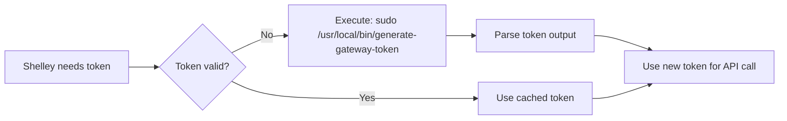

# Shelley Authentication Analysis

## Executive Summary

Shelley authenticates with the LOM (LLM Operations Manager) backend at `https://exe.dev` using **SSH-signed JWT tokens** that are generated locally on-demand using the server's SSH host key.

## How Access Tokens Work

### Token Generation

1. **Token Generator**: `/usr/local/bin/generate-gateway-token`
   - A Go binary that creates bearer tokens signed with the SSH host key
   - Default location of SSH key: `/exe.dev/etc/ssh/ssh_host_ed25519_key`
   - Default TTL: **90000 seconds (25 hours)**

2. **Token Structure**:
   ```
   <base64-encoded-payload>.<base64-encoded-ssh-signature>
   ```

3. **Token Payload** (JSON):
   ```json
   {
     "box_name": "joshair.exe.dev",
     "created_at": "2025-11-03T15:40:49.392581846Z",
     "ttl_seconds": 90000
   }
   ```

4. **Signature**: Ed25519 SSH signature of the payload

### Example Token Generation

```bash
sudo /usr/local/bin/generate-gateway-token
# Options:
#   -host string        name of host
#   -key string         path to ssh host identity key (default "/exe.dev/etc/ssh/ssh_host_ed25519_key")
#   -ttl_seconds int    time to live, in seconds (default 90000)
```

## Shelley Configuration

**Config File**: `/exe.dev/shelley.json`

```json
{
  "default_model": "claude-sonnet-4.5",
  "key_generator": "sudo /usr/local/bin/generate-gateway-token",
  "llm_gateway": "https://exe.dev",
  "terminal_url": "https://joshair.xterm.exe.dev"
}
```

### Key Configuration Parameters

- **`llm_gateway`**: The LOM backend endpoint (`https://exe.dev`)
- **`key_generator`**: Command to execute for token generation
- **`default_model`**: Default LLM model to use

## How Shelley Obtains Tokens

### On Startup

When Shelley starts, it:
1. Reads the configuration from `/exe.dev/shelley.json`
2. **Immediately executes** the `key_generator` command
3. Captures the generated token
4. Uses this token for all LLM gateway requests

Evidence from startup logs:
```
Nov 03 15:40:49 shelley[32868]: level=INFO msg="Using LLM gateway" gateway=https://exe.dev
Nov 03 15:40:49 sudo[32873]:   exedev : COMMAND=/usr/local/bin/generate-gateway-token
Nov 03 15:40:49 shelley[32868]: level=DEBUG msg="Using key from generator" command="sudo /usr/local/bin/generate-gateway-token"
```

### During Runtime

Based on the code analysis, Shelley likely:
1. **Caches** the token in memory
2. **Regenerates** the token when making LLM API requests if needed
3. Calls the `key_generator` command again when the token is expired or invalid

## Why Tokens Expire

### Token Expiration Timeline

- **Default TTL**: 90000 seconds = **25 hours**
- **Service Start**: Nov 1, 2025 02:43:21 UTC
- **Token Expiry**: ~Nov 2, 2025 03:43:21 UTC
- **Current Time**: Nov 3, 2025 15:40 UTC
- **Status**: **EXPIRED** ✗

### Calculation

```bash
# Service started
START_EPOCH=1730429001  # 2025-11-01 02:43:21 UTC

# Token expires after 90000 seconds (25 hours)
EXPIRY_EPOCH=$((START_EPOCH + 90000))  # 1762055001

# Current time
CURRENT_EPOCH=1762184394  # 2025-11-03 15:40 UTC

# Difference
EXPIRED_BY=$((CURRENT_EPOCH - EXPIRY_EPOCH))  # 129,393 seconds (~36 hours overdue)
```

### Why Use Expiring Tokens?

1. **Security**: Limits exposure window if token is compromised
2. **Access Control**: Backend can revoke access by rejecting old signatures
3. **Audit Trail**: Time-bounded tokens enable better tracking
4. **Resource Management**: Prevents indefinite token validity

## Token Refresh Process

### Automatic Refresh

Shelley refreshes tokens by **re-executing the token generator command**:



### Manual Refresh (Restart Service)

To force a fresh token:

```bash
# Restart the Shelley service
sudo systemctl restart shelley.service

# Verify it's running and generated a new token
sudo systemctl status shelley.service
sudo journalctl -u shelley.service -n 20
```

**Evidence**: When we restarted the service, the logs showed:
```
Nov 03 15:40:49 sudo[32873]: COMMAND=/usr/local/bin/generate-gateway-token
Nov 03 15:40:49 shelley[32868]: msg="Using key from generator"
```

## Authentication Flow Diagram

```
┌─────────────────────────────────────────────────────────────────┐
│                        Shelley Web UI                           │
│                     (Port 9999 / Browser)                       │
└────────────────────────────┬────────────────────────────────────┘
                             │
                             │ HTTP Request (User prompt)
                             ▼
┌─────────────────────────────────────────────────────────────────┐
│                      Shelley Server                             │
│                  (/usr/local/bin/shelley)                       │
└────────────┬───────────────────────────────────┬────────────────┘
             │                                   │
             │ 1. Check if token valid?          │
             ▼                                   │
      ┌──────────────┐                          │
      │ Token Cache  │                          │
      └──────┬───────┘                          │
             │ Expired/Missing                  │
             ▼                                   │
      ┌──────────────────────────────────┐      │
      │ Execute Token Generator:         │      │
      │ sudo /usr/local/bin/             │      │
      │   generate-gateway-token         │      │
      └──────┬───────────────────────────┘      │
             │                                   │
             │ 2. Signs payload with             │
             │    SSH host key                   │
             ▼                                   │
      ┌──────────────────────────────────┐      │
      │ JWT-style Token:                 │      │
      │ {box_name, created_at, ttl}      │      │
      │ + Ed25519 signature              │      │
      └──────┬───────────────────────────┘      │
             │                                   │
             │ 3. Token returned                 │
             └──────────────────────────────────►│
                                                 │
                                                 │ 4. HTTPS request with token
                                                 ▼
                          ┌──────────────────────────────────────┐
                          │   LOM Backend (https://exe.dev)      │
                          │                                      │
                          │  /_/gateway/anthropic/v1/messages   │
                          │  /_/gateway/openai/v1/...           │
                          └──────┬───────────────────────────────┘
                                 │
                                 │ 5. Verify signature using
                                 │    box's public SSH key
                                 ▼
                          ┌──────────────────┐
                          │  SSH Key Store   │
                          │  (exe.dev has    │
                          │   public keys)   │
                          └──────────────────┘
```

## Security Model

### How LOM Backend Validates Tokens

1. **Token Reception**: Backend receives token in HTTP Authorization header
2. **Payload Extraction**: Decodes base64 payload
3. **Signature Verification**:
   - Uses the box's **public SSH key** (known to exe.dev)
   - Verifies Ed25519 signature matches payload
   - Checks `box_name` matches the expected box
4. **TTL Validation**:
   - Checks `created_at + ttl_seconds > current_time`
   - Rejects expired tokens
5. **Access Grant**: If valid, allows API call

### Trust Chain

```
Box SSH Host Key (Private)
         ↓
    Signs payload
         ↓
   Creates token
         ↓
Sent to exe.dev LOM backend
         ↓
Verified with box's public key
         ↓
  Access granted/denied
```

## Systemd Service Configuration

**Service File**: `/etc/systemd/system/shelley.service`

```ini
[Unit]
Description=Shelley-the-Agent

[Service]
Type=exec
User=exedev
Group=exedev
WorkingDirectory=/home/exedev/src
ExecStartPre=/bin/mkdir -p /home/exedev/.shelley
ExecStart=/usr/local/bin/shelley -debug -db /home/exedev/.shelley/shelley.db -config /exe.dev/shelley.json serve -port 9999
Restart=always
RestartSec=5
Environment=HOME=/home/exedev
Environment=USER=exedev
Environment=PATH=/headless-shell:/usr/local/sbin:/usr/local/bin:/usr/sbin:/usr/bin:/sbin:/bin
KillMode=process
TimeoutStopSec=10

StandardOutput=journal
StandardError=journal
SyslogIdentifier=shelley

[Install]
WantedBy=multi-user.target
```

### Key Service Parameters

- **User**: `exedev` (non-root, but has sudo access for token generation)
- **Working Directory**: `/home/exedev/src`
- **Database**: `/home/exedev/.shelley/shelley.db` (SQLite)
- **Port**: 9999
- **Auto-restart**: Yes (on failure, after 5 seconds)

## Data Storage

### Database Location

**Path**: `/home/exedev/.shelley/shelley.db`

**Schema**:
```sql
-- Conversations table
CREATE TABLE conversations (
    conversation_id TEXT PRIMARY KEY,
    slug TEXT,
    user_initiated BOOLEAN NOT NULL DEFAULT TRUE,
    created_at DATETIME NOT NULL DEFAULT CURRENT_TIMESTAMP,
    updated_at DATETIME NOT NULL DEFAULT CURRENT_TIMESTAMP
);

-- Messages table
CREATE TABLE messages (
    message_id TEXT PRIMARY KEY,
    conversation_id TEXT NOT NULL,
    sequence_id INTEGER NOT NULL,
    type TEXT NOT NULL CHECK (type IN ('user', 'agent', 'tool', 'system', 'error')),
    llm_data TEXT,        -- JSON data sent to/from LLM
    user_data TEXT,       -- JSON data for UI display
    usage_data TEXT,      -- JSON data about token usage
    created_at DATETIME NOT NULL DEFAULT CURRENT_TIMESTAMP,
    display_data TEXT,
    FOREIGN KEY (conversation_id) REFERENCES conversations(conversation_id)
);
```

**Note**: Tokens are **not stored** in the database - they're generated on-demand.

## Common Operations

### View Current Token

```bash
# Generate a fresh token (same way Shelley does)
sudo /usr/local/bin/generate-gateway-token
```

### Decode Token

```bash
# Generate and decode
TOKEN=$(sudo /usr/local/bin/generate-gateway-token)
echo "$TOKEN" | cut -d'.' -f1 | base64 -d | python3 -m json.tool
```

### Check Token Expiration

```bash
TOKEN=$(sudo /usr/local/bin/generate-gateway-token)
PAYLOAD=$(echo "$TOKEN" | cut -d'.' -f1 | base64 -d)
CREATED=$(echo "$PAYLOAD" | python3 -c "import sys, json; print(json.load(sys.stdin)['created_at'])")
TTL=$(echo "$PAYLOAD" | python3 -c "import sys, json; print(json.load(sys.stdin)['ttl_seconds'])")

echo "Token created: $CREATED"
echo "TTL: $TTL seconds"
echo "Expires at: $(date -d "$CREATED + $TTL seconds" --iso-8601=seconds)"
```

### Force Token Refresh

```bash
# Method 1: Restart Shelley service
sudo systemctl restart shelley.service

# Method 2: Wait for Shelley to auto-refresh on next API call
# (Shelley will regenerate the token when it detects expiration)
```

### Monitor Token Generation

```bash
# Watch Shelley logs for token generation events
sudo journalctl -u shelley.service -f | grep -i "key from generator\|generate-gateway-token"
```

## Troubleshooting

### Issue: "Authentication failed" errors

**Cause**: Token expired or invalid

**Solution**:
```bash
# 1. Check if service is running
sudo systemctl status shelley.service

# 2. Restart service to get fresh token
sudo systemctl restart shelley.service

# 3. Verify token generation in logs
sudo journalctl -u shelley.service -n 20 | grep "key from generator"
```

### Issue: Service won't start after restart

**Cause**: Database migration issues (as we encountered)

**Solution**:
```bash
# Check the error
sudo journalctl -u shelley.service -n 50

# If there's a CHECK constraint error on message types:
sqlite3 /home/exedev/.shelley/shelley.db "UPDATE messages SET type = 'system' WHERE type NOT IN ('user', 'agent', 'tool', 'system', 'error');"

# Then restart
sudo systemctl start shelley.service
```

### Issue: Want to change token TTL

**Solution**:
```bash
# Edit the config to use a custom token generator command
sudo nano /exe.dev/shelley.json

# Change:
# "key_generator": "sudo /usr/local/bin/generate-gateway-token -ttl_seconds 172800"
# (172800 = 48 hours)

# Restart service
sudo systemctl restart shelley.service
```

## Summary

### Why Current Tokens Expired

1. Shelley service started **2 days ago** (Nov 1, 02:43 UTC)
2. Default token TTL is **25 hours**
3. Any token from startup expired **~36 hours ago**
4. Solution: **Restart the service** to generate a fresh token

### Token Refresh Process

1. **On Startup**: Shelley calls `sudo /usr/local/bin/generate-gateway-token`
2. **During Runtime**: Shelley regenerates tokens when needed (on API calls if expired)
3. **Manual Refresh**: `sudo systemctl restart shelley.service`

### Key Insights

- **No persistent tokens**: Tokens aren't stored; they're generated on-demand
- **SSH-based trust**: Uses the box's SSH host key for signing
- **Stateless**: Each token is self-contained and verifiable
- **Restart = Fresh token**: Restarting Shelley always generates a new token
- **LOM validates**: Backend verifies signature using box's public key

## Files Reference

| File | Purpose |
|------|---------|
| `/usr/local/bin/shelley` | Main Shelley server binary |
| `/usr/local/bin/generate-gateway-token` | Token generator binary |
| `/exe.dev/shelley.json` | Configuration file |
| `/exe.dev/etc/ssh/ssh_host_ed25519_key` | SSH private key (for signing) |
| `/exe.dev/etc/ssh/ssh_host_ed25519_key.pub` | SSH public key |
| `/home/exedev/.shelley/shelley.db` | SQLite database (conversations) |
| `/etc/systemd/system/shelley.service` | Systemd service definition |

---

**Generated**: 2025-11-03 15:40 UTC
**Status**: Shelley service running with fresh token ✓
